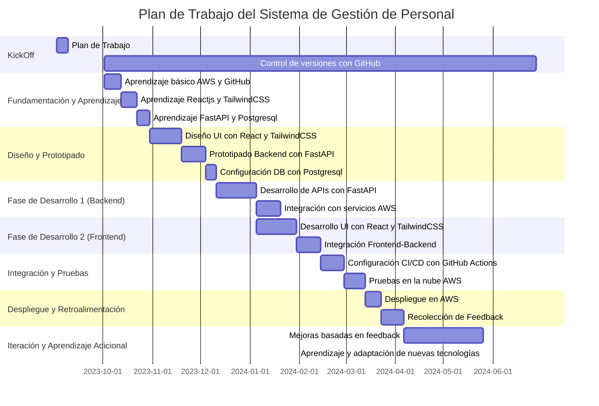
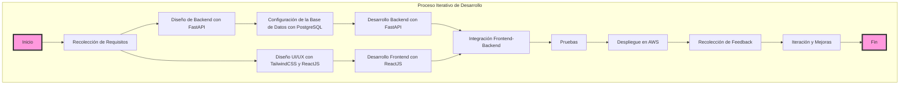

```mermaid
gantt
    title Plan de Trabajo del Sistema de Gestión de Personal
    dateFormat  YYYY-MM-DD
    
    section KickOff
    Plan de Trabajo :a0, 2023-9-02, 7d
    Control de versiones con GitHub : ongoing, 2023-10-02, 270d
   
    section Fundamentación y Aprendizaje
    Aprendizaje básico AWS y GitHub :a1, 2023-10-02, 10d
    Aprendizaje Reactjs y TailwindCSS :a2, after a1, 10d
    Aprendizaje FastAPI y Postgresql :a3, after a2, 8d
    
    section Diseño y Prototipado
    Diseño UI con React y TailwindCSS :a4, after a3, 20d
    Prototipado Backend con FastAPI :a5, after a4, 15d
    Configuración DB con Postgresql :a6, after a5, 7d
    
    section Fase de Desarrollo 1 (Backend)
    Desarrollo de APIs con FastAPI :a7, after a6, 25d
    Integración con servicios AWS :a8, after a7, 15d
    
    section Fase de Desarrollo 2 (Frontend)
    Desarrollo UI con React y TailwindCSS :a9, after a7, 25d
    Integración Frontend-Backend :a10, after a9, 15d
    
    section Integración y Pruebas
    Configuración CI/CD con GitHub Actions :a11, after a10, 15d
    Pruebas en la nube AWS :a12, after a11, 13d
    
    section Despliegue y Retroalimentación
    Despliegue en AWS :a13, after a12, 10d
    Recolección de Feedback :a14, after a13, 14d

    section Iteración y Aprendizaje Adicional
    Mejoras basadas en feedback :a15, after a14, 50d
    Aprendizaje y adaptación de nuevas tecnologías : ongoing, after a15, 30
```
---

```mermaid
graph TD

subgraph "Proceso Iterativo de Desarrollo"
    A[Inicio]
    B[Recolección de Requisitos]
    C[Diseño UI/UX con TailwindCSS y ReactJS]
    D[Diseño de Backend con FastAPI]
    E[Configuración de la Base de Datos con PostgreSQL]
    F[Desarrollo Frontend con ReactJS]
    G[Desarrollo Backend con FastAPI]
    H[Integración Frontend-Backend]
    I[Pruebas]
    J[Despliegue en AWS]
    K[Recolección de Feedback]
    L[Iteración y Mejoras]
    M[Fin]
end

A --> B
B --> C
B --> D
D --> E
E --> G
C --> F
G --> H
F --> H
H --> I
I --> J
J --> K
K --> L
L --> M

style A fill:#f9d,stroke:#333,stroke-width:4px
style M fill:#f9d,stroke:#333,stroke-width:4px
```