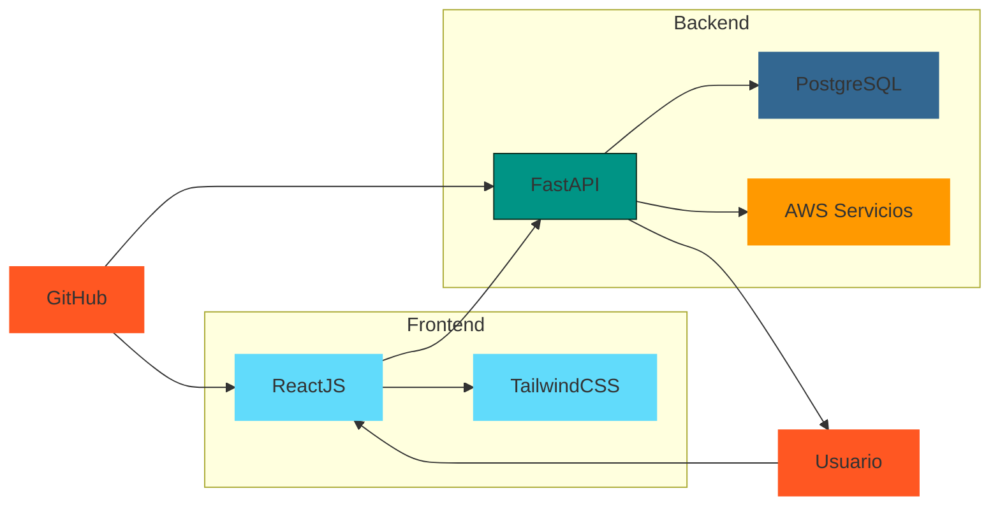

```mermaid
graph LR

    subgraph Frontend
        A[ReactJS] --> B[TailwindCSS]
    end

    subgraph Backend
        C[FastAPI] --> D[PostgreSQL]
        C --> E[AWS Servicios]
    end

    F[GitHub] --> A
    F --> C
    G[Usuario] --> A
    A --> C
    C --> G

    classDef aws fill:#FF9900,stroke:#FF9900,stroke-width:1px;
    classDef db fill:#336791,stroke:#336791,stroke-width:1px;
    classDef frontend fill:#61DBFB,stroke:#61DBFB,stroke-width:1px;
    classDef backend fill:#009485,stroke:#092E20,stroke-width:1px;
    classDef other fill:#FF5722,stroke:#FF5722,stroke-width:1px;

    class A,B frontend;
    class C backend;
    class D db;
    class E aws;
    class F,G other;

```