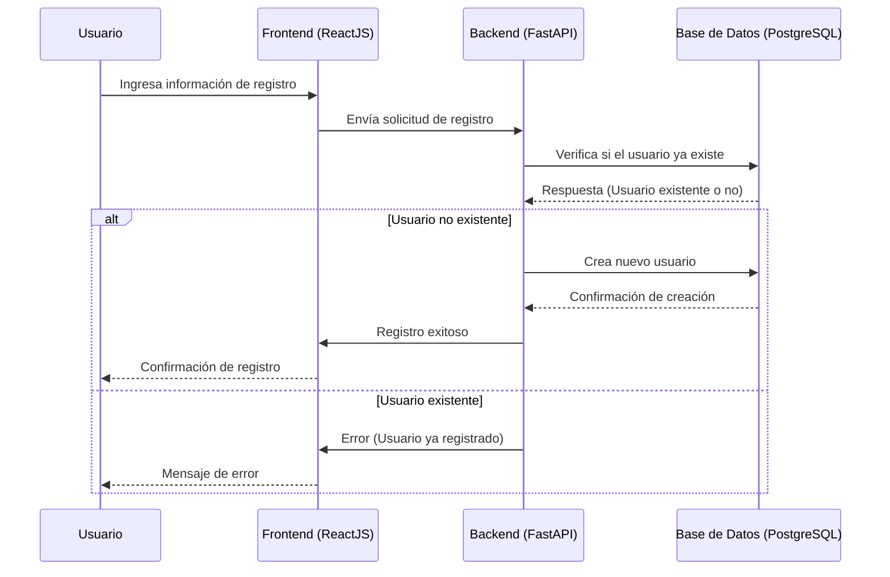

```mermaid
sequenceDiagram
    participant U as Usuario
    participant F as Frontend (ReactJS)
    participant B as Backend (FastAPI)
    participant DB as Base de Datos (PostgreSQL)
    
    U->>F: Ingresa información de registro
    F->>B: Envía solicitud de registro
    B->>DB: Verifica si el usuario ya existe
    DB-->>B: Respuesta (Usuario existente o no)
    alt Usuario no existente
        B->>DB: Crea nuevo usuario
        DB-->>B: Confirmación de creación
        B->>F: Registro exitoso
        F-->>U: Confirmación de registro
    else Usuario existente
        B->>F: Error (Usuario ya registrado)
        F-->>U: Mensaje de error
    end

```